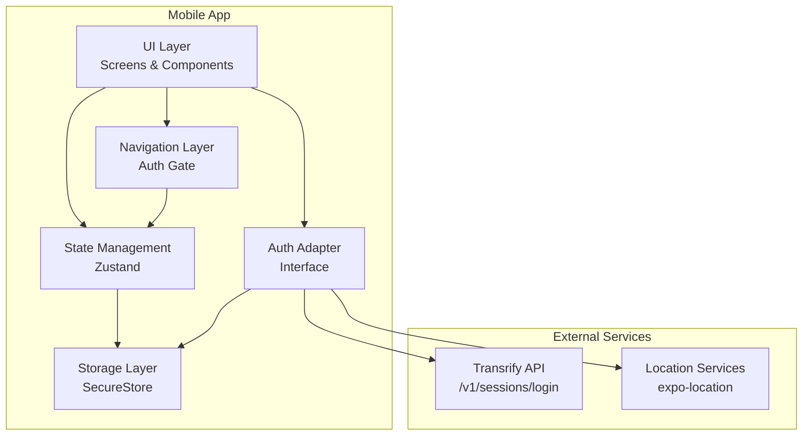
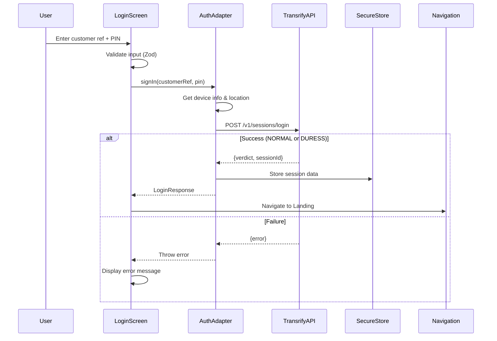
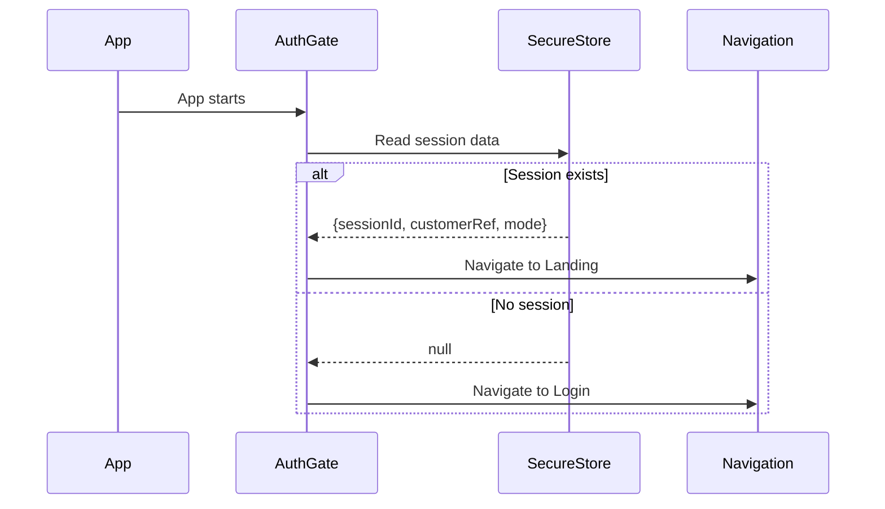
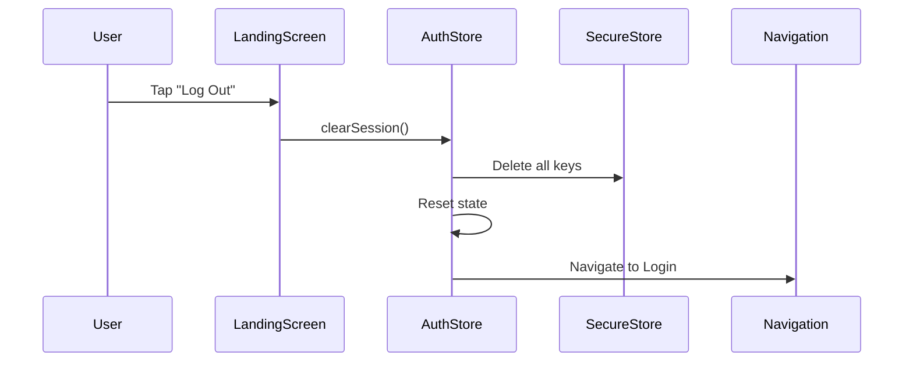
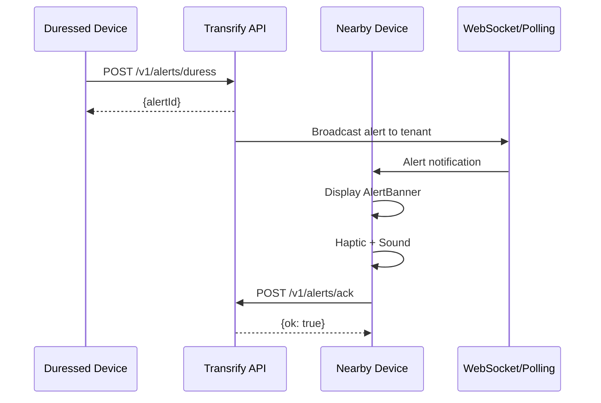

# Design Document

## Overview

The Transrify mobile app is an Expo-managed React Native application that implements a dual-PIN authentication system for silent duress detection. The app provides a seamless authentication experience where users can signal distress using an alternative PIN without alerting potential attackers. The design emphasizes security, simplicity, and plausible deniability.

### Key Design Principles

1. **Plausible Deniability**: DURESS and NORMAL authentication states must be visually and behaviorally identical
2. **Security First**: All sensitive data stored in encrypted SecureStore, no credentials in source code
3. **Expo Go Compatible**: Use only managed Expo SDK packages without custom native modules
4. **Minimal UI**: Clean, dark-themed interface with essential functionality only
5. **Replaceable Backend**: Auth adapter pattern allows swapping authentication providers

## Architecture

### High-Level Architecture



### Technology Stack

- **Framework**: React Native with Expo SDK 52
- **Navigation**: React Navigation 6.x (Stack Navigator)
- **State Management**: Zustand (lightweight, minimal boilerplate)
- **Forms**: React Hook Form + Zod validation
- **Styling**: NativeWind (Tailwind for React Native) or StyleSheet fallback
- **Storage**: expo-secure-store (encrypted key-value storage)
- **Location**: expo-location (geolocation for emergency response)
- **Testing**: Jest + @testing-library/react-native
- **Type Safety**: TypeScript with strict mode


## Project Structure

```
/src
  /app
    AppNavigator.tsx           # Root navigator with auth gate
  /screens
    LoginScreen.tsx            # Customer ref + PIN authentication
    LandingScreen.tsx          # Post-auth home screen
  /components
    Button.tsx                 # Reusable button component
    TextInput.tsx              # Reusable input component
    Screen.tsx                 # Safe area wrapper
    Logo.tsx                   # Transrify logo component
  /lib
    auth.ts                    # Auth adapter interface + implementations
    storage.ts                 # SecureStore helpers
    validation.ts              # Zod schemas
    theme.ts                   # Colors, spacing, typography
    api.ts                     # Typed API client with retry logic
    sessions.ts                # Session login and verify functions
    evidence.ts                # Evidence presign, upload, and finalize
  /config.ts                   # Environment configuration
  /state
    useAuthStore.ts            # Zustand auth state
  /types
    index.ts                   # TypeScript type definitions
/tests
  LoginScreen.test.tsx
  LandingScreen.test.tsx
  auth.test.ts
app.json                       # Expo configuration
babel.config.js
tailwind.config.js             # NativeWind configuration (optional)
tsconfig.json
.env.example                   # Environment variable template
```

## Components and Interfaces

### Navigation Structure

```mermaid
stateDiagram-v2
    [*] --> AppStart
    AppStart --> CheckToken: App Launch
    CheckToken --> AuthStack: No Token
    CheckToken --> AppStack: Token Exists
    
    state AuthStack {
        [*] --> Login
        Login --> AppStack: Auth Success
    }
    
    state AppStack {
        [*] --> Landing
        Landing --> AuthStack: Logout
    }
```

**Auth Gate Logic:**
1. On app start, read token from SecureStore
2. If token exists → navigate to AppStack (Landing)
3. If no token → navigate to AuthStack (Login)
4. Show loading indicator during token check (max 2 seconds)

### Screen Components

#### LoginScreen

**Purpose**: Authenticate users with customer reference and PIN

**UI Elements:**
- Header: "Welcome back" title, "Sign in to continue" subtitle
- Customer Reference input (alphanumeric, 3-50 chars)
- PIN input (numeric, 4-8 digits, masked)
- Sign In button (primary CTA)
- Disabled placeholders: "Forgot password?", "Create account"
- Error message area (inline, below form)

**States:**
- Idle: Form ready for input
- Validating: Real-time validation feedback
- Submitting: Loading spinner on button, inputs disabled
- Error: Display error message, re-enable form

**Validation Rules (Zod):**
```typescript
customerRef: z.string()
  .min(3, "Customer reference must be at least 3 characters")
  .max(50, "Customer reference must be at most 50 characters")
  .regex(/^[a-zA-Z0-9_-]+$/, "Only letters, numbers, underscore, and dash allowed")

pin: z.string()
  .min(4, "PIN must be at least 4 digits")
  .max(8, "PIN must be at most 8 digits")
  .regex(/^\d+$/, "PIN must contain only digits")
```

**Behavior:**
- Disable submit button until validation passes
- Clear errors on input change
- Prevent double-submission during API call
- Request location permission on first launch
- Call auth adapter on submit
- Navigate based on verdict (NORMAL/DURESS → Landing, FAIL → show error)


#### LandingScreen

**Purpose**: Display authenticated user information and provide logout

**UI Elements:**
- Header: Transrify logo, customer reference
- Card: "You're signed in" message, session ID tail (last 4 chars)
- Limited Mode Pill: Subtle indicator when limitedMode is true (e.g., "Limited Mode (Monitoring)")
- Log Out button (secondary CTA)

**States:**
- Normal: Full access mode (NORMAL verdict)
- Limited: Limited access mode (DURESS verdict) - shows subtle monitoring indicator

**Behavior:**
- Display customer reference from auth state
- Display last 4 characters of session ID
- If limitedMode is true, display subtle "Limited Mode" pill indicator
- On logout: clear SecureStore, reset state, navigate to Login
- **Note**: Limited mode shows a subtle indicator but maintains normal functionality

**Future Extensibility:**
- Limited mode can restrict features (e.g., transaction limits, disabled actions)
- Evidence collection can be triggered in limited mode
- Background monitoring can track user activity

### Reusable Components

#### Button Component

**Props:**
```typescript
interface ButtonProps {
  title: string;
  onPress: () => void;
  variant?: 'primary' | 'secondary';
  loading?: boolean;
  disabled?: boolean;
  accessibilityLabel?: string;
}
```

**Variants:**
- Primary: Purple background (#7C4DFF), white text
- Secondary: Transparent background, purple border, purple text

**States:**
- Default, Pressed, Disabled, Loading (spinner)

#### TextInput Component

**Props:**
```typescript
interface TextInputProps {
  label: string;
  value: string;
  onChangeText: (text: string) => void;
  placeholder?: string;
  secureTextEntry?: boolean;
  keyboardType?: 'default' | 'numeric' | 'email-address';
  error?: string;
  accessibilityLabel?: string;
}
```

**Features:**
- Label above input
- Error message below input (red text)
- Focus/blur states with border color change
- Secure text entry for PIN field

#### Screen Component

**Purpose**: Consistent safe area wrapper for all screens

**Features:**
- SafeAreaView for iOS notch/status bar
- Consistent padding and background color
- Keyboard-aware scroll view (optional)

#### Logo Component

**Purpose**: Display Transrify branding

**Implementation:**
- SVG or PNG asset
- Responsive sizing
- Consistent placement across screens


## Data Models

### Authentication Types

```typescript
// API Request
interface LoginRequest {
  tenantKey: string;
  customerRef: string;
  pin: string;
  deviceInfo: {
    platform: 'ios' | 'android';
    version: string;
    ip?: string;
  };
  geo?: {
    lat: number;
    lng: number;
  };
}

// API Response
interface LoginResponse {
  verdict: 'NORMAL' | 'DURESS' | 'FAIL';
  recommendedAction: 'ALLOW' | 'LIMIT_AND_MONITOR' | 'DENY';
  sessionId: string;
}

// API Error Response
interface ApiError {
  ok: false;
  error: 'INVALID_TENANT_KEY' | 'TENANT_SUSPENDED' | 'MISSING_REQUIRED_FIELDS' | 'RATE_LIMIT_EXCEEDED';
}

// User Data
interface User {
  customerRef: string;
  sessionId: string;
}

// Auth State
interface AuthState {
  user: User | null;
  sessionMode: 'NORMAL' | 'DURESS' | null;
  limitedMode: boolean;
  isAuthenticated: boolean;
  isLoading: boolean;
  setSession: (user: User, mode: 'NORMAL' | 'DURESS') => void;
  clearSession: () => void;
  setLoading: (loading: boolean) => void;
  initializeAuth: () => Promise<void>;
}
```

### Auth Adapter Interface

```typescript
interface AuthAdapter {
  /**
   * Authenticate user with customer reference and PIN
   * @returns LoginResponse with verdict and session ID
   * @throws Error with API error code
   */
  signIn(customerRef: string, pin: string): Promise<LoginResponse>;
  
  /**
   * Sign out current user (no-op for stateless API)
   */
  signOut(): Promise<void>;
  
  /**
   * Get current user from stored session
   * @returns User data or null if not authenticated
   */
  getCurrentUser(): Promise<User | null>;
}
```

### Storage Keys

```typescript
const STORAGE_KEYS = {
  SESSION_ID: 'transrify_session_id',
  CUSTOMER_REF: 'transrify_customer_ref',
  SESSION_MODE: 'transrify_session_mode',
  TENANT_KEY: 'transrify_tenant_key',
} as const;
```

**Security Notes:**
- Never store PIN in any form
- Store session mode for internal tracking only (never display)
- Use SecureStore for all sensitive data
- Clear all keys on logout


## Authentication Flow

### Sign In Flow



### App Launch Flow



### Logout Flow



## State Management

### Zustand Store Design

```typescript
// useAuthStore.ts
import create from 'zustand';
import * as storage from '../lib/storage';

interface AuthState {
  user: User | null;
  sessionMode: 'NORMAL' | 'DURESS' | null;
  isAuthenticated: boolean;
  isLoading: boolean;
  
  setSession: (user: User, mode: 'NORMAL' | 'DURESS') => void;
  clearSession: () => void;
  setLoading: (loading: boolean) => void;
  initializeAuth: () => Promise<void>;
}

export const useAuthStore = create<AuthState>((set) => ({
  user: null,
  sessionMode: null,
  limitedMode: false,
  isAuthenticated: false,
  isLoading: true,
  
  setSession: (user, mode) => {
    const limitedMode = mode === 'DURESS';
    set({ user, sessionMode: mode, limitedMode, isAuthenticated: true });
  },
  
  clearSession: async () => {
    await storage.clearAll();
    set({ user: null, sessionMode: null, limitedMode: false, isAuthenticated: false });
  },
  
  setLoading: (loading) => {
    set({ isLoading: loading });
  },
  
  initializeAuth: async () => {
    set({ isLoading: true });
    try {
      const sessionId = await storage.getSessionId();
      const customerRef = await storage.getCustomerRef();
      const mode = await storage.getSessionMode();
      
      if (sessionId && customerRef && mode) {
        const limitedMode = mode === 'DURESS';
        set({
          user: { customerRef, sessionId },
          sessionMode: mode as 'NORMAL' | 'DURESS',
          limitedMode,
          isAuthenticated: true,
        });
      }
    } catch (error) {
      console.error('Failed to initialize auth:', error);
    } finally {
      set({ isLoading: false });
    }
  },
}));
```

**State Flow:**
1. App starts → `initializeAuth()` reads from SecureStore
2. Login success → `setSession()` updates state and SecureStore
3. Logout → `clearSession()` clears state and SecureStore


## API Integration

### Mobile API Endpoints

The app integrates with the following Transrify API endpoints:

#### POST /v1/sessions/login
**Purpose**: Authenticate user and determine access mode

**Request:**
```typescript
{
  tenantKey: string;
  customerRef: string;
  pin: string;
  deviceInfo: {
    platform: 'ios' | 'android';
    version: string;
    ip?: string;
  };
  geo?: {
    lat: number;
    lng: number;
  };
}
```

**Response:**
```typescript
{
  verdict: 'NORMAL' | 'DURESS' | 'FAIL';
  recommendedAction: 'ALLOW' | 'LIMIT_AND_MONITOR' | 'DENY';
  sessionId: string;
}
```

**Mobile Behavior:**
- `NORMAL` → Proceed to Landing in normal mode
- `DURESS` → Proceed to Landing in Limited Mode (appears normal), set limitedMode=true, start background monitoring
- `FAIL` → Show error message on Login screen

#### GET /v1/sessions/verify
**Purpose**: Verify session validity (optional, used on app resume)

**Request:** `?sessionId={uuid}`

**Response:**
```typescript
{
  ok: boolean;
  session: {
    id: string;
    result: string;
    createdAt: string;
    customerRef: string;
    tenantName: string;
  };
}
```

**Mobile Behavior:**
- Call on app resume or when NavigationContainer state changes
- If session is invalid, clear auth state and navigate to Login
- If network error, continue with current session

#### POST /v1/evidence/presign
**Purpose**: Get presigned URL for evidence upload

**Request:**
```typescript
{
  incidentId: string;
  contentType: string;
}
```

**Response:**
```typescript
{
  url: string;  // Presigned PUT URL (5 min expiry)
  key: string;  // S3 object key
}
```

**Mobile Behavior:**
- Call before uploading media evidence
- Use returned URL for direct S3 upload
- URL expires in 5 minutes

#### POST /evidence/finalize
**Purpose**: Finalize evidence upload after S3 PUT

**Request:**
```typescript
{
  incidentId: string;
  kind: 'VIDEO' | 'AUDIO' | 'PHOTO' | 'NEARBY' | 'TEXT';
  key: string;
  size: number;
  sha256: string;
  encIv?: string;
}
```

**Response:**
```typescript
{
  ok: true;
  id: string;
}
```

**Mobile Behavior:**
- Call after successful S3 upload
- Compute SHA-256 hash client-side using expo-crypto
- Retry up to 2 times on failure with exponential backoff

**Rate Limits:**
- 30 requests/minute per IP
- Handle 429 responses with exponential backoff (800-1200ms jitter)

### Auth Adapter Implementations

#### Production Adapter (Transrify API)

```typescript
// lib/auth.ts
import * as Location from 'expo-location';
import * as Application from 'expo-application';
import { Platform } from 'react-native';
import * as storage from './storage';

class TransrifyAuthAdapter implements AuthAdapter {
  private baseURL: string;
  
  constructor(baseURL: string) {
    this.baseURL = baseURL;
  }
  
  async signIn(customerRef: string, pin: string): Promise<LoginResponse> {
    // Get tenant key from secure storage
    const tenantKey = await storage.getTenantKey();
    if (!tenantKey) {
      throw new Error('INVALID_TENANT_KEY');
    }
    
    // Get device info
    const deviceInfo = {
      platform: Platform.OS as 'ios' | 'android',
      version: Application.nativeApplicationVersion || '1.0.0',
    };
    
    // Get location (with timeout)
    let geo: { lat: number; lng: number } | undefined;
    try {
      const { status } = await Location.requestForegroundPermissionsAsync();
      if (status === 'granted') {
        const location = await Location.getCurrentPositionAsync({
          accuracy: Location.Accuracy.Balanced,
          timeInterval: 5000,
        });
        geo = {
          lat: location.coords.latitude,
          lng: location.coords.longitude,
        };
      }
    } catch (error) {
      console.warn('Location unavailable:', error);
    }
    
    // Make API request
    const response = await fetch(`${this.baseURL}/v1/sessions/login`, {
      method: 'POST',
      headers: { 'Content-Type': 'application/json' },
      body: JSON.stringify({
        tenantKey,
        customerRef,
        pin,
        deviceInfo,
        geo,
      }),
    });
    
    if (!response.ok) {
      const error = await response.json();
      throw new Error(error.error || 'AUTHENTICATION_FAILED');
    }
    
    const data: LoginResponse = await response.json();
    
    // Store session data
    await storage.setSessionId(data.sessionId);
    await storage.setCustomerRef(customerRef);
    await storage.setSessionMode(data.verdict);
    
    return data;
  }
  
  async signOut(): Promise<void> {
    // Stateless API - just clear local storage
    await storage.clearAll();
  }
  
  async getCurrentUser(): Promise<User | null> {
    const sessionId = await storage.getSessionId();
    const customerRef = await storage.getCustomerRef();
    
    if (sessionId && customerRef) {
      return { sessionId, customerRef };
    }
    
    return null;
  }
}
```

#### Mock Adapter (Development)

```typescript
class MockAuthAdapter implements AuthAdapter {
  async signIn(customerRef: string, pin: string): Promise<LoginResponse> {
    // Simulate network delay
    await new Promise(resolve => setTimeout(resolve, 1000));
    
    // Mock logic: PIN ending in 1 = DURESS, others = NORMAL
    const isDuress = pin.endsWith('1');
    const isValid = customerRef.length >= 3 && pin.length >= 4;
    
    if (!isValid) {
      return {
        verdict: 'FAIL',
        recommendedAction: 'DENY',
        sessionId: '',
      };
    }
    
    const sessionId = `mock-${Date.now()}-${Math.random().toString(36).substr(2, 9)}`;
    const verdict = isDuress ? 'DURESS' : 'NORMAL';
    
    // Store session data
    await storage.setSessionId(sessionId);
    await storage.setCustomerRef(customerRef);
    await storage.setSessionMode(verdict);
    
    return {
      verdict,
      recommendedAction: isDuress ? 'LIMIT_AND_MONITOR' : 'ALLOW',
      sessionId,
    };
  }
  
  async signOut(): Promise<void> {
    await storage.clearAll();
  }
  
  async getCurrentUser(): Promise<User | null> {
    const sessionId = await storage.getSessionId();
    const customerRef = await storage.getCustomerRef();
    
    if (sessionId && customerRef) {
      return { sessionId, customerRef };
    }
    
    return null;
  }
}

// Export based on environment
export const authAdapter: AuthAdapter = 
  process.env.EXPO_PUBLIC_USE_MOCK_AUTH === 'true'
    ? new MockAuthAdapter()
    : new TransrifyAuthAdapter(process.env.EXPO_PUBLIC_API_BASE_URL || 'https://api.transrify.com');
```

### Environment Configuration

```typescript
// .env.example
EXPO_PUBLIC_API_BASE_URL=https://api.example.com
EXPO_PUBLIC_TENANT_KEY=DEMO_TENANT
EXPO_PUBLIC_USE_MOCK_AUTH=false
EXPO_PUBLIC_APP_ENV=production

// For development
// EXPO_PUBLIC_USE_MOCK_AUTH=true
// EXPO_PUBLIC_APP_ENV=development
```

**Configuration Strategy:**
- Use `expo-constants` to read environment variables
- Prefix with `EXPO_PUBLIC_` for client-side access
- Store tenant key in environment variables (not SecureStore)
- Never commit actual credentials to source control

**Config Module (src/config.ts):**
```typescript
import Constants from 'expo-constants';
import { Platform } from 'react-native';

export const API_BASE_URL = process.env.EXPO_PUBLIC_API_BASE_URL ?? 'https://api.example.com';
export const TENANT_KEY = process.env.EXPO_PUBLIC_TENANT_KEY ?? 'DEMO_TENANT';
export const APP_VERSION = Constants.expoConfig?.version ?? '1.0.0';

export const isAndroid = Platform.OS === 'android';
export const isIOS = Platform.OS === 'ios';
```

### API Client Implementation

**Typed API Client (src/lib/api.ts):**
```typescript
import { API_BASE_URL } from '../config';

export async function api<T>(
  path: string,
  init?: RequestInit & { retry?: boolean }
): Promise<T> {
  const url = `${API_BASE_URL}${path}`;
  
  const resp = await fetch(url, {
    headers: { 'Content-Type': 'application/json' },
    ...init,
  });
  
  // Handle rate limiting with exponential backoff
  if (resp.status === 429 && init?.retry !== false) {
    const jitter = Math.random() * 400; // 0-400ms jitter
    await new Promise(r => setTimeout(r, 800 + jitter));
    return api<T>(path, { ...init, retry: false });
  }
  
  if (!resp.ok) {
    throw new Error(`HTTP ${resp.status}`);
  }
  
  return resp.json() as Promise<T>;
}
```

### Session Management Implementation

**Session Functions (src/lib/sessions.ts):**
```typescript
import * as Location from 'expo-location';
import { Platform } from 'react-native';
import { API_BASE_URL, TENANT_KEY, APP_VERSION } from '../config';
import { api } from './api';

export type LoginVerdict = 'NORMAL' | 'DURESS' | 'FAIL';
export type RecommendedAction = 'ALLOW' | 'LIMIT_AND_MONITOR' | 'DENY';

export async function loginSession(customerRef: string, pin: string) {
  // Request location permission
  const { status } = await Location.getForegroundPermissionsAsync();
  let coords = { latitude: 0, longitude: 0 };
  
  if (status === 'granted') {
    const loc = await Location.getCurrentPositionAsync({});
    coords = { latitude: loc.coords.latitude, longitude: loc.coords.longitude };
  }
  
  return api<{
    verdict: LoginVerdict;
    recommendedAction: RecommendedAction;
    sessionId: string;
  }>('/v1/sessions/login', {
    method: 'POST',
    body: JSON.stringify({
      tenantKey: TENANT_KEY,
      customerRef,
      pin,
      deviceInfo: {
        platform: Platform.OS,
        version: APP_VERSION,
      },
      geo: { lat: coords.latitude, lng: coords.longitude },
    }),
  });
}

export async function verifySession(sessionId: string) {
  return api<{
    ok: boolean;
    session: any;
  }>(`/v1/sessions/verify?sessionId=${encodeURIComponent(sessionId)}`);
}
```

### Evidence Collection Implementation

**Evidence Functions (src/lib/evidence.ts):**
```typescript
import * as Crypto from 'expo-crypto';
import { api } from './api';

export async function presignEvidence(incidentId: string, contentType: string) {
  return api<{ url: string; key: string }>(
    '/v1/evidence/presign',
    {
      method: 'POST',
      body: JSON.stringify({ incidentId, contentType }),
    }
  );
}

export async function finalizeEvidence(input: {
  incidentId: string;
  kind: 'VIDEO' | 'AUDIO' | 'PHOTO' | 'NEARBY' | 'TEXT';
  key: string;
  size: number;
  sha256: string;
  encIv?: string;
}) {
  return api<{ ok: true; id: string }>(
    '/evidence/finalize',
    {
      method: 'POST',
      body: JSON.stringify(input),
    }
  );
}

export async function sha256String(s: string) {
  return Crypto.digestStringAsync(Crypto.CryptoDigestAlgorithm.SHA256, s);
}

export async function uploadToS3(presignedUrl: string, file: Blob, contentType: string) {
  const resp = await fetch(presignedUrl, {
    method: 'PUT',
    headers: { 'Content-Type': contentType },
    body: file,
  });
  
  if (!resp.ok) {
    throw new Error(`S3 upload failed: ${resp.status}`);
  }
}
```


## Error Handling

### Error Categories

1. **Validation Errors**: Client-side, handled by Zod
2. **API Errors**: Server-side, returned by Transrify API
3. **Network Errors**: Connection issues, timeouts
4. **Storage Errors**: SecureStore failures

### Error Mapping

```typescript
// lib/errors.ts
export const ERROR_MESSAGES: Record<string, string> = {
  // API Errors
  INVALID_TENANT_KEY: 'Configuration error. Please contact support.',
  TENANT_SUSPENDED: 'Service unavailable. Please contact support.',
  RATE_LIMIT_EXCEEDED: 'Too many attempts. Please wait a minute.',
  MISSING_REQUIRED_FIELDS: 'Invalid request. Please try again.',
  AUTHENTICATION_FAILED: 'Invalid credentials. Please try again.',
  
  // Network Errors
  NETWORK_ERROR: 'Network error. Please check your connection.',
  TIMEOUT_ERROR: 'Request timed out. Please try again.',
  
  // Storage Errors
  STORAGE_ERROR: 'Storage error. Please restart the app.',
  
  // Default
  UNKNOWN_ERROR: 'An error occurred. Please try again.',
};

export function getErrorMessage(error: unknown): string {
  if (error instanceof Error) {
    return ERROR_MESSAGES[error.message] || ERROR_MESSAGES.UNKNOWN_ERROR;
  }
  return ERROR_MESSAGES.UNKNOWN_ERROR;
}
```

### Error Handling Strategy

**LoginScreen:**
```typescript
const handleSignIn = async () => {
  try {
    setIsSubmitting(true);
    setError(null);
    
    const response = await authAdapter.signIn(customerRef, pin);
    
    if (response.verdict === 'FAIL') {
      setError('Invalid credentials. Please try again.');
      return;
    }
    
    // Update state
    useAuthStore.getState().setSession(
      { customerRef, sessionId: response.sessionId },
      response.verdict
    );
    
    // Navigate to Landing (identical for NORMAL and DURESS)
    navigation.navigate('Landing');
    
  } catch (error) {
    setError(getErrorMessage(error));
  } finally {
    setIsSubmitting(false);
  }
};
```

**Global Error Boundary:**
```typescript
// components/ErrorBoundary.tsx
class ErrorBoundary extends React.Component<Props, State> {
  state = { hasError: false };
  
  static getDerivedStateFromError() {
    return { hasError: true };
  }
  
  componentDidCatch(error: Error, errorInfo: ErrorInfo) {
    console.error('App error:', error, errorInfo);
    // Optional: Send to error tracking service
  }
  
  render() {
    if (this.state.hasError) {
      return (
        <Screen>
          <Text>Something went wrong. Please restart the app.</Text>
          <Button title="Restart" onPress={() => this.setState({ hasError: false })} />
        </Screen>
      );
    }
    
    return this.props.children;
  }
}
```

### Rate Limiting Handling

```typescript
// Exponential backoff for rate limit errors
let retryCount = 0;
const MAX_RETRIES = 3;

async function signInWithRetry(customerRef: string, pin: string): Promise<LoginResponse> {
  try {
    return await authAdapter.signIn(customerRef, pin);
  } catch (error) {
    if (error instanceof Error && error.message === 'RATE_LIMIT_EXCEEDED') {
      if (retryCount < MAX_RETRIES) {
        retryCount++;
        const delay = Math.pow(2, retryCount) * 1000; // 2s, 4s, 8s
        await new Promise(resolve => setTimeout(resolve, delay));
        return signInWithRetry(customerRef, pin);
      }
    }
    throw error;
  }
}
```


## UI/UX Design

### Design System

#### Color Palette (Dark Theme)

```typescript
// lib/theme.ts
export const colors = {
  // Backgrounds
  background: '#0B0B10',      // Screen background
  surface: '#15151E',         // Card/surface background
  
  // Primary
  primary: '#7C4DFF',         // Primary actions, focus states
  primaryHover: '#6A3FE8',    // Pressed state
  primaryDisabled: '#4A2D99', // Disabled state
  
  // Text
  textPrimary: '#EDEDED',     // Primary text
  textSecondary: '#A0A0AE',   // Muted/secondary text
  textDisabled: '#5A5A66',    // Disabled text
  
  // Status
  error: '#FF5252',           // Error messages
  success: '#4CAF50',         // Success states (future)
  warning: '#FFC107',         // Warning states (future)
  
  // Borders
  border: '#2A2A35',          // Default borders
  borderFocus: '#7C4DFF',     // Focus state borders
  borderError: '#FF5252',     // Error state borders
};

export const spacing = {
  xs: 4,
  sm: 8,
  md: 12,
  lg: 16,
  xl: 24,
  xxl: 32,
};

export const borderRadius = {
  sm: 8,
  md: 12,
  lg: 16,
  xl: 20,
};

export const typography = {
  h1: {
    fontSize: 32,
    fontWeight: '700' as const,
    lineHeight: 40,
  },
  h2: {
    fontSize: 24,
    fontWeight: '600' as const,
    lineHeight: 32,
  },
  body: {
    fontSize: 16,
    fontWeight: '400' as const,
    lineHeight: 24,
  },
  caption: {
    fontSize: 14,
    fontWeight: '400' as const,
    lineHeight: 20,
  },
  button: {
    fontSize: 16,
    fontWeight: '600' as const,
    lineHeight: 24,
  },
};
```

#### Component Styling

**Button:**
```typescript
// Primary variant
{
  backgroundColor: colors.primary,
  paddingVertical: spacing.lg,
  paddingHorizontal: spacing.xl,
  borderRadius: borderRadius.xl,
  // Pressed state
  backgroundColor: colors.primaryHover,
  // Disabled state
  backgroundColor: colors.primaryDisabled,
}

// Secondary variant
{
  backgroundColor: 'transparent',
  borderWidth: 2,
  borderColor: colors.primary,
  paddingVertical: spacing.lg - 2, // Account for border
  paddingHorizontal: spacing.xl - 2,
  borderRadius: borderRadius.xl,
}
```

**TextInput:**
```typescript
{
  backgroundColor: colors.surface,
  borderWidth: 1,
  borderColor: colors.border,
  borderRadius: borderRadius.md,
  paddingVertical: spacing.md,
  paddingHorizontal: spacing.lg,
  color: colors.textPrimary,
  fontSize: typography.body.fontSize,
  // Focus state
  borderColor: colors.borderFocus,
  // Error state
  borderColor: colors.borderError,
}
```

**Card:**
```typescript
{
  backgroundColor: colors.surface,
  borderRadius: borderRadius.lg,
  padding: spacing.xl,
  marginVertical: spacing.md,
}
```

### Screen Layouts

#### LoginScreen Layout

```
┌─────────────────────────────────┐
│                                 │
│         [Logo]                  │
│                                 │
│      Welcome back               │ ← H1
│   Sign in to continue           │ ← Caption
│                                 │
│   ┌─────────────────────────┐   │
│   │ Customer Reference      │   │ ← TextInput
│   └─────────────────────────┘   │
│                                 │
│   ┌─────────────────────────┐   │
│   │ PIN (••••)              │   │ ← TextInput (secure)
│   └─────────────────────────┘   │
│                                 │
│   [Error message here]          │ ← Error text (conditional)
│                                 │
│   ┌─────────────────────────┐   │
│   │      Sign In            │   │ ← Primary Button
│   └─────────────────────────┘   │
│                                 │
│   Forgot password?              │ ← Disabled link
│   Create account                │ ← Disabled link
│                                 │
└─────────────────────────────────┘
```

#### LandingScreen Layout

```
┌─────────────────────────────────┐
│  [Logo]    customer@ref         │ ← Header
├─────────────────────────────────┤
│                                 │
│   ┌─────────────────────────┐   │
│   │                         │   │
│   │  You're signed in.      │   │ ← Card
│   │                         │   │
│   │  Session: ...abcd       │   │ ← Session ID tail
│   │                         │   │
│   └─────────────────────────┘   │
│                                 │
│   ┌─────────────────────────┐   │
│   │      Log Out            │   │ ← Secondary Button
│   └─────────────────────────┘   │
│                                 │
└─────────────────────────────────┘
```

### Accessibility

**WCAG 2.1 AA Compliance:**
- Color contrast ratio ≥ 4.5:1 for normal text
- Color contrast ratio ≥ 3:1 for large text
- All interactive elements ≥ 44x44 points touch target
- Screen reader labels for all inputs and buttons
- Keyboard navigation support (for future web version)

**Implementation:**
```typescript
<TextInput
  accessibilityLabel="Customer reference input"
  accessibilityHint="Enter your customer reference"
  accessibilityRole="text"
/>

<Button
  accessibilityLabel="Sign in button"
  accessibilityHint="Tap to sign in with your credentials"
  accessibilityRole="button"
  accessibilityState={{ disabled: !isValid }}
/>
```


## Testing Strategy

### Testing Pyramid

```
        ┌─────────────┐
        │   E2E (5%)  │  Manual testing in Expo Go
        ├─────────────┤
        │ Integration │  Component + API integration
        │    (25%)    │
        ├─────────────┤
        │    Unit     │  Business logic, utilities
        │    (70%)    │
        └─────────────┘
```

### Unit Tests

**Auth Adapter Tests:**
```typescript
// tests/auth.test.ts
describe('TransrifyAuthAdapter', () => {
  it('should successfully authenticate with valid credentials', async () => {
    const adapter = new TransrifyAuthAdapter('https://api.test.com');
    const response = await adapter.signIn('TEST_USER', '1234');
    expect(response.verdict).toBe('NORMAL');
    expect(response.sessionId).toBeDefined();
  });
  
  it('should handle DURESS verdict', async () => {
    const adapter = new TransrifyAuthAdapter('https://api.test.com');
    const response = await adapter.signIn('TEST_USER', '9876');
    expect(response.verdict).toBe('DURESS');
    expect(response.recommendedAction).toBe('LIMIT_AND_MONITOR');
  });
  
  it('should throw error for invalid tenant key', async () => {
    const adapter = new TransrifyAuthAdapter('https://api.test.com');
    await expect(adapter.signIn('TEST_USER', '1234')).rejects.toThrow('INVALID_TENANT_KEY');
  });
});
```

**Storage Tests:**
```typescript
// tests/storage.test.ts
describe('Storage', () => {
  beforeEach(async () => {
    await storage.clearAll();
  });
  
  it('should store and retrieve session ID', async () => {
    await storage.setSessionId('test-session-123');
    const sessionId = await storage.getSessionId();
    expect(sessionId).toBe('test-session-123');
  });
  
  it('should clear all storage keys', async () => {
    await storage.setSessionId('test-session');
    await storage.setCustomerRef('test-customer');
    await storage.clearAll();
    
    const sessionId = await storage.getSessionId();
    const customerRef = await storage.getCustomerRef();
    expect(sessionId).toBeNull();
    expect(customerRef).toBeNull();
  });
});
```

**Validation Tests:**
```typescript
// tests/validation.test.ts
describe('Validation Schemas', () => {
  it('should validate correct customer reference', () => {
    const result = customerRefSchema.safeParse('TEST_USER_123');
    expect(result.success).toBe(true);
  });
  
  it('should reject customer reference with special characters', () => {
    const result = customerRefSchema.safeParse('test@user');
    expect(result.success).toBe(false);
  });
  
  it('should validate correct PIN', () => {
    const result = pinSchema.safeParse('1234');
    expect(result.success).toBe(true);
  });
  
  it('should reject PIN with non-numeric characters', () => {
    const result = pinSchema.safeParse('12ab');
    expect(result.success).toBe(false);
  });
});
```

### Integration Tests

**LoginScreen Tests:**
```typescript
// tests/LoginScreen.test.tsx
describe('LoginScreen', () => {
  it('should render input fields and button', () => {
    const { getByLabelText, getByText } = render(<LoginScreen />);
    expect(getByLabelText('Customer reference input')).toBeTruthy();
    expect(getByLabelText('PIN input')).toBeTruthy();
    expect(getByText('Sign In')).toBeTruthy();
  });
  
  it('should disable button when input is invalid', () => {
    const { getByText, getByLabelText } = render(<LoginScreen />);
    const button = getByText('Sign In');
    expect(button.props.accessibilityState.disabled).toBe(true);
  });
  
  it('should enable button when input is valid', async () => {
    const { getByText, getByLabelText } = render(<LoginScreen />);
    const customerRefInput = getByLabelText('Customer reference input');
    const pinInput = getByLabelText('PIN input');
    
    fireEvent.changeText(customerRefInput, 'TEST_USER');
    fireEvent.changeText(pinInput, '1234');
    
    await waitFor(() => {
      const button = getByText('Sign In');
      expect(button.props.accessibilityState.disabled).toBe(false);
    });
  });
  
  it('should navigate to Landing on successful login', async () => {
    const mockNavigate = jest.fn();
    const { getByText, getByLabelText } = render(
      <LoginScreen navigation={{ navigate: mockNavigate }} />
    );
    
    fireEvent.changeText(getByLabelText('Customer reference input'), 'TEST_USER');
    fireEvent.changeText(getByLabelText('PIN input'), '1234');
    fireEvent.press(getByText('Sign In'));
    
    await waitFor(() => {
      expect(mockNavigate).toHaveBeenCalledWith('Landing');
    });
  });
  
  it('should display error message on failed login', async () => {
    const { getByText, getByLabelText } = render(<LoginScreen />);
    
    fireEvent.changeText(getByLabelText('Customer reference input'), 'TEST_USER');
    fireEvent.changeText(getByLabelText('PIN input'), '0000');
    fireEvent.press(getByText('Sign In'));
    
    await waitFor(() => {
      expect(getByText('Invalid credentials. Please try again.')).toBeTruthy();
    });
  });
});
```

**LandingScreen Tests:**
```typescript
// tests/LandingScreen.test.tsx
describe('LandingScreen', () => {
  beforeEach(() => {
    useAuthStore.setState({
      user: { customerRef: 'TEST_USER', sessionId: 'session-123456' },
      sessionMode: 'NORMAL',
      isAuthenticated: true,
    });
  });
  
  it('should display customer reference', () => {
    const { getByText } = render(<LandingScreen />);
    expect(getByText('TEST_USER')).toBeTruthy();
  });
  
  it('should display session ID tail', () => {
    const { getByText } = render(<LandingScreen />);
    expect(getByText(/3456/)).toBeTruthy(); // Last 4 chars
  });
  
  it('should navigate to Login on logout', async () => {
    const mockNavigate = jest.fn();
    const { getByText } = render(
      <LandingScreen navigation={{ navigate: mockNavigate }} />
    );
    
    fireEvent.press(getByText('Log Out'));
    
    await waitFor(() => {
      expect(mockNavigate).toHaveBeenCalledWith('Login');
      expect(useAuthStore.getState().isAuthenticated).toBe(false);
    });
  });
  
  it('should look identical for NORMAL and DURESS modes', () => {
    // Test NORMAL mode
    useAuthStore.setState({ sessionMode: 'NORMAL' });
    const { toJSON: normalJSON } = render(<LandingScreen />);
    
    // Test DURESS mode
    useAuthStore.setState({ sessionMode: 'DURESS' });
    const { toJSON: duressJSON } = render(<LandingScreen />);
    
    // UI should be identical
    expect(normalJSON()).toEqual(duressJSON());
  });
});
```

### Manual Testing Checklist

**iOS Testing (Expo Go):**
- [ ] Login with valid credentials (NORMAL)
- [ ] Login with duress PIN (DURESS) - verify identical UI
- [ ] Login with invalid credentials (FAIL)
- [ ] Logout and verify session cleared
- [ ] App restart with active session
- [ ] App restart without session
- [ ] Location permission granted
- [ ] Location permission denied
- [ ] Network error handling
- [ ] Rate limit error handling
- [ ] Screen reader navigation
- [ ] Dark mode appearance

**Android Testing (Expo Go):**
- [ ] Same checklist as iOS
- [ ] Back button behavior
- [ ] Hardware keyboard input (if available)

### Performance Testing

**Metrics to Monitor:**
- App launch time: < 2 seconds to first screen
- Login API call: < 500ms (excluding network latency)
- SecureStore read/write: < 100ms
- Screen navigation: < 200ms transition
- Memory usage: < 100MB baseline

**Tools:**
- React DevTools Profiler
- Expo Performance Monitor
- Chrome DevTools (for debugging)


## Security Considerations

### Data Security

**Sensitive Data Storage:**
- ✅ Use SecureStore for: session ID, customer reference, session mode, tenant key
- ❌ Never store: PIN, passwords, raw credentials
- ✅ Clear all SecureStore data on logout
- ✅ Validate data integrity on read

**Network Security:**
- ✅ Use HTTPS only for API calls
- ✅ Implement request timeout (10 seconds)
- ✅ Validate SSL certificates (default in Expo)
- 🔮 Future: Certificate pinning for production

**Code Security:**
- ✅ No hardcoded credentials in source code
- ✅ Use environment variables for configuration
- ✅ Obfuscate production builds (future)
- ✅ Remove console.log in production

### Duress Detection Security

**Critical Requirements:**
1. **Zero Visual Indicators**: DURESS mode must be visually identical to NORMAL mode
2. **No Behavioral Differences**: Navigation, timing, animations must be identical
3. **No Debug Leaks**: No console logs, error messages, or debug info revealing duress state
4. **Secure Storage**: Session mode stored in SecureStore, never displayed to user

**Implementation Checklist:**
- [ ] Landing screen renders identically for NORMAL and DURESS
- [ ] No conditional UI based on session mode
- [ ] No timing differences between modes
- [ ] No console.log statements revealing mode
- [ ] Session mode only used for internal tracking
- [ ] Tests verify visual parity between modes

### Input Validation

**Client-Side Validation:**
```typescript
// Prevent injection attacks
const sanitizeInput = (input: string): string => {
  return input.trim().replace(/[<>]/g, '');
};

// Validate before sending to API
const validateCustomerRef = (ref: string): boolean => {
  return /^[a-zA-Z0-9_-]{3,50}$/.test(ref);
};

const validatePIN = (pin: string): boolean => {
  return /^\d{4,8}$/.test(pin);
};
```

**Rate Limiting:**
- Implement exponential backoff for failed attempts
- Respect API rate limits (30 requests/minute)
- Cache successful authentication to reduce API calls

### Privacy Considerations

**Location Data:**
- Request permission with clear explanation
- Only collect when permission granted
- Don't block authentication if location unavailable
- Include location in API request for emergency response

**Data Minimization:**
- Only collect necessary data (customer ref, PIN, device info, location)
- Don't log sensitive information
- Clear data on logout

**User Consent:**
- Location permission request with clear purpose
- Privacy policy link (future)
- Terms of service acceptance (future)

## Performance Optimization

### Bundle Size Optimization

**Strategies:**
- Use Expo's built-in tree shaking
- Avoid large dependencies (prefer lightweight alternatives)
- Lazy load screens if app grows
- Optimize images (use WebP, compress assets)

**Current Bundle Estimate:**
- React Native + Expo: ~30MB
- Dependencies: ~5MB
- App code: <1MB
- Total: ~35MB (acceptable for Expo Go)

### Runtime Performance

**Optimization Techniques:**
1. **Memoization**: Use React.memo for components, useMemo for expensive calculations
2. **Lazy Loading**: Defer non-critical imports
3. **Image Optimization**: Use appropriate image sizes, cache images
4. **State Updates**: Batch state updates, avoid unnecessary re-renders

**Example:**
```typescript
// Memoize expensive validation
const isFormValid = useMemo(() => {
  return validateCustomerRef(customerRef) && validatePIN(pin);
}, [customerRef, pin]);

// Memoize components
const MemoizedButton = React.memo(Button);
```

### Network Optimization

**Strategies:**
- Implement request caching for repeated calls
- Use request timeouts to prevent hanging
- Retry failed requests with exponential backoff
- Compress request/response payloads (gzip)

## Deployment Strategy

### Development Workflow

1. **Local Development**: Use Expo Go with mock auth adapter
2. **Testing**: Run Jest tests, manual testing on iOS/Android
3. **Staging**: Deploy to Expo with staging API URL
4. **Production**: Deploy to Expo with production API URL

### Environment Configuration

```typescript
// config.ts
const ENV = {
  development: {
    apiBaseURL: 'https://api-dev.transrify.com',
    useMockAuth: true,
  },
  staging: {
    apiBaseURL: 'https://api-staging.transrify.com',
    useMockAuth: false,
  },
  production: {
    apiBaseURL: 'https://api.transrify.com',
    useMockAuth: false,
  },
};

export const config = ENV[process.env.EXPO_PUBLIC_APP_ENV || 'development'];
```

### Build Configuration

**app.json:**
```json
{
  "expo": {
    "name": "Transrify",
    "slug": "transrify-mobile",
    "version": "1.0.0",
    "orientation": "portrait",
    "icon": "./assets/icon.png",
    "userInterfaceStyle": "dark",
    "splash": {
      "image": "./assets/splash.png",
      "resizeMode": "contain",
      "backgroundColor": "#0B0B10"
    },
    "ios": {
      "supportsTablet": true,
      "bundleIdentifier": "com.transrify.mobile",
      "infoPlist": {
        "NSLocationWhenInUseUsageDescription": "We use your location to enhance security and provide emergency assistance if needed.",
        "NSCameraUsageDescription": "We need camera access to capture evidence for your safety.",
        "NSMicrophoneUsageDescription": "We need microphone access to record audio evidence for your safety."
      }
    },
    "android": {
      "adaptiveIcon": {
        "foregroundImage": "./assets/adaptive-icon.png",
        "backgroundColor": "#0B0B10"
      },
      "package": "com.transrify.mobile",
      "permissions": [
        "ACCESS_FINE_LOCATION",
        "ACCESS_COARSE_LOCATION",
        "CAMERA",
        "RECORD_AUDIO"
      ]
    },
    "plugins": [
      "expo-secure-store",
      "expo-location",
      "expo-camera",
      "expo-av"
    ]
  }
}
```

### Release Checklist

- [ ] All tests passing
- [ ] TypeScript compilation successful
- [ ] No console.log statements in production code
- [ ] Environment variables configured
- [ ] Tenant key stored in SecureStore
- [ ] Location permissions configured
- [ ] App icons and splash screen added
- [ ] Privacy policy and terms of service (future)
- [ ] Manual testing on iOS and Android
- [ ] Performance metrics within acceptable range
- [ ] Security review completed

## Future Enhancements

### Phase 2 Features

1. **Biometric Authentication**: Face ID, Touch ID, fingerprint
2. **Forgot Password Flow**: Password reset via email/SMS
3. **Sign Up Flow**: New user registration
4. **Light Mode**: Toggle between dark and light themes
5. **Multi-Language Support**: i18n for multiple languages
6. **Offline Mode**: Cache data for offline access
7. **Push Notifications**: Alerts and notifications
8. **Evidence Collection**: Audio/video recording during duress

### Technical Debt

1. **Certificate Pinning**: Implement for production security
2. **Error Tracking**: Integrate Sentry or similar service
3. **Analytics**: Track user behavior and app performance
4. **A/B Testing**: Test different UI/UX variations
5. **Automated E2E Tests**: Detox or Maestro for E2E testing

### Scalability Considerations

1. **State Management**: Consider Redux if state complexity grows
2. **Code Splitting**: Lazy load screens and features
3. **Micro-Frontends**: Modularize app into independent features
4. **Backend Integration**: Support multiple auth providers (Supabase, Cognito, etc.)

## Duress Proximity Alerts

### Overview

The Duress Proximity Alerts feature enables real-time notification of nearby users when someone authenticates with a duress PIN. This provides immediate awareness to colleagues within a configurable radius while maintaining plausible deniability on the duressed device.

### Architecture



### API Endpoints

#### POST /v1/alerts/duress

**Purpose**: Send duress alert to notify nearby users

**Request:**
```typescript
{
  sessionId: string;
  tenantKey: string;
  geo: {
    lat: number;
    lng: number;
  };
  accuracy: number;
  alertKind: 'DURESS';
  device: {
    platform: 'ios' | 'android';
    appVersion: string;
  };
}
```

**Response:**
```typescript
{
  ok: true;
  alertId: string;
}
```

#### GET /v1/alerts/nearby

**Purpose**: Poll for nearby duress alerts (fallback when WebSocket unavailable)

**Query Parameters:**
- `tenantKey`: Organization identifier
- `lat`: Current latitude
- `lng`: Current longitude
- `radius`: Search radius in meters (default: 1000)
- `since`: ISO timestamp for incremental updates

**Response:**
```typescript
{
  ok: true;
  alerts: Array<{
    id: string;
    kind: 'DURESS';
    sessionId: string;
    customerRef: string;
    geo: {
      lat: number;
      lng: number;
    };
    createdAt: string; // ISO timestamp
  }>;
}
```

#### POST /v1/alerts/ack

**Purpose**: Acknowledge receipt and response to an alert

**Request:**
```typescript
{
  alertId: string;
  ackBy: string; // Customer reference of acknowledging user
  method: 'NFC' | 'PUSH' | 'INAPP';
}
```

**Response:**
```typescript
{
  ok: true;
}
```

#### WebSocket: wss://.../alerts/subscribe

**Purpose**: Real-time alert delivery (preferred over polling)

**Connection:** `wss://api.example.com/alerts/subscribe?tenantKey=TENANT`

**Message Format:**
```typescript
{
  type: 'DURESS_ALERT';
  alert: {
    id: string;
    kind: 'DURESS';
    sessionId: string;
    customerRef: string;
    geo: { lat: number; lng: number };
    createdAt: string;
  };
}
```

### Client Implementation

#### Alert State Management

```typescript
// state/useAlertsStore.ts
interface Alert {
  id: string;
  kind: 'DURESS';
  sessionId: string;
  customerRef: string;
  geo: { lat: number; lng: number };
  createdAt: string;
  distance?: number; // Computed client-side
}

interface AlertsState {
  alerts: Alert[];
  lastCheckedAt: string | null;
  subscribed: boolean;
  wsConnection: WebSocket | null;
  
  addAlert: (alert: Alert) => void;
  removeAlert: (alertId: string) => void;
  startForegroundAlerts: (tenantKey: string, userGeo: { lat: number; lng: number }) => void;
  stopForegroundAlerts: () => void;
  connectWebSocket: (tenantKey: string) => void;
  disconnectWebSocket: () => void;
}
```

**Implementation Strategy:**
1. On app foreground + authenticated → `startForegroundAlerts()`
2. Try WebSocket connection first
3. If WebSocket fails → fall back to polling every 15s
4. On app background or logout → `stopForegroundAlerts()`
5. Compute distance client-side using Haversine formula

#### Alert Library

```typescript
// lib/alerts.ts
import { API_BASE_URL, TENANT_KEY } from '../config';
import { api } from './api';

export async function sendDuressAlert(
  sessionId: string,
  tenantKey: string,
  geo: { lat: number; lng: number },
  device: { platform: string; appVersion: string }
) {
  return api<{ ok: true; alertId: string }>('/v1/alerts/duress', {
    method: 'POST',
    body: JSON.stringify({
      sessionId,
      tenantKey,
      geo,
      accuracy: 30, // meters
      alertKind: 'DURESS',
      device,
    }),
  });
}

export async function pollNearbyAlerts(
  tenantKey: string,
  geo: { lat: number; lng: number },
  radius: number = 1000,
  since?: string
) {
  const params = new URLSearchParams({
    tenantKey,
    lat: geo.lat.toString(),
    lng: geo.lng.toString(),
    radius: radius.toString(),
    ...(since && { since }),
  });
  
  return api<{
    ok: true;
    alerts: Array<{
      id: string;
      kind: 'DURESS';
      sessionId: string;
      customerRef: string;
      geo: { lat: number; lng: number };
      createdAt: string;
    }>;
  }>(`/v1/alerts/nearby?${params}`);
}

export async function ackAlert(
  alertId: string,
  ackBy: string,
  method: 'NFC' | 'PUSH' | 'INAPP'
) {
  return api<{ ok: true }>('/v1/alerts/ack', {
    method: 'POST',
    body: JSON.stringify({ alertId, ackBy, method }),
  });
}

export function connectAlertsSocket(
  tenantKey: string,
  onMessage: (alert: any) => void
): WebSocket | null {
  try {
    const wsUrl = process.env.EXPO_PUBLIC_WS_URL;
    if (!wsUrl) return null;
    
    const ws = new WebSocket(`${wsUrl}/alerts/subscribe?tenantKey=${tenantKey}`);
    
    ws.onmessage = (event) => {
      const data = JSON.parse(event.data);
      if (data.type === 'DURESS_ALERT') {
        onMessage(data.alert);
      }
    };
    
    ws.onerror = (error) => {
      console.warn('WebSocket error:', error);
    };
    
    return ws;
  } catch (error) {
    console.warn('Failed to connect WebSocket:', error);
    return null;
  }
}
```

#### Geolocation Helpers

```typescript
// lib/geo.ts
import * as Location from 'expo-location';

export async function getCurrentLocation(): Promise<{ lat: number; lng: number } | null> {
  try {
    const { status } = await Location.getForegroundPermissionsAsync();
    if (status !== 'granted') return null;
    
    const location = await Location.getCurrentPositionAsync({
      accuracy: Location.Accuracy.Balanced,
    });
    
    return {
      lat: location.coords.latitude,
      lng: location.coords.longitude,
    };
  } catch (error) {
    console.warn('Failed to get location:', error);
    return null;
  }
}

// Haversine formula for distance calculation
export function calculateDistance(
  lat1: number,
  lng1: number,
  lat2: number,
  lng2: number
): number {
  const R = 6371e3; // Earth radius in meters
  const φ1 = (lat1 * Math.PI) / 180;
  const φ2 = (lat2 * Math.PI) / 180;
  const Δφ = ((lat2 - lat1) * Math.PI) / 180;
  const Δλ = ((lng2 - lng1) * Math.PI) / 180;
  
  const a =
    Math.sin(Δφ / 2) * Math.sin(Δφ / 2) +
    Math.cos(φ1) * Math.cos(φ2) * Math.sin(Δλ / 2) * Math.sin(Δλ / 2);
  const c = 2 * Math.atan2(Math.sqrt(a), Math.sqrt(1 - a));
  
  return R * c; // Distance in meters
}

export function formatDistance(meters: number): string {
  if (meters < 1000) {
    return `${Math.round(meters)}m`;
  }
  return `${(meters / 1000).toFixed(1)}km`;
}
```

#### Push Notifications

```typescript
// lib/push.ts
import * as Notifications from 'expo-notifications';
import { Platform } from 'react-native';

export async function registerForPushNotifications(): Promise<string | null> {
  try {
    const { status: existingStatus } = await Notifications.getPermissionsAsync();
    let finalStatus = existingStatus;
    
    if (existingStatus !== 'granted') {
      const { status } = await Notifications.requestPermissionsAsync();
      finalStatus = status;
    }
    
    if (finalStatus !== 'granted') {
      return null;
    }
    
    const token = (await Notifications.getExpoPushTokenAsync()).data;
    
    if (Platform.OS === 'android') {
      Notifications.setNotificationChannelAsync('duress-alerts', {
        name: 'Duress Alerts',
        importance: Notifications.AndroidImportance.HIGH,
        vibrationPattern: [0, 250, 250, 250],
        lightColor: '#FF5252',
      });
    }
    
    return token;
  } catch (error) {
    console.warn('Failed to register for push notifications:', error);
    return null;
  }
}

export async function getPushTokenAsync(): Promise<string | null> {
  try {
    const token = (await Notifications.getExpoPushTokenAsync()).data;
    return token;
  } catch (error) {
    return null;
  }
}
```

#### NFC Integration (Feature-Flagged)

```typescript
// lib/nfc.ts
const NFC_ENABLED = process.env.EXPO_PUBLIC_NFC_ENABLED === 'true';

export const isNfcAvailable = NFC_ENABLED;

export async function startNfcReader(
  onRead: (payload: string) => void
): Promise<void> {
  if (!NFC_ENABLED) {
    throw new Error('NFC is disabled in Expo Go. Use a Development Build to enable NFC.');
  }
  
  // In Development Build, this would use react-native-nfc-manager
  // For now, this is a stub that throws an error
  throw new Error('NFC implementation requires Development Build with react-native-nfc-manager');
}

export async function stopNfcReader(): Promise<void> {
  if (!NFC_ENABLED) return;
  
  // Stub for Development Build implementation
}

export async function writeNfcTag(payload: string): Promise<void> {
  if (!NFC_ENABLED) {
    throw new Error('NFC is disabled in Expo Go');
  }
  
  // Stub for Development Build implementation
}
```

### UI Components

#### AlertBanner Component

```typescript
// components/AlertBanner.tsx
import React, { useEffect } from 'react';
import { View, Text, TouchableOpacity, StyleSheet } from 'react-native';
import * as Haptics from 'expo-haptics';
import { colors, spacing, borderRadius } from '../lib/theme';
import { isNfcAvailable } from '../lib/nfc';

interface AlertBannerProps {
  alert: {
    id: string;
    customerRef: string;
    distance?: number;
  };
  onAck: () => void;
  onMap: () => void;
  onCall: () => void;
  onNfc?: () => void;
}

export function AlertBanner({ alert, onAck, onMap, onCall, onNfc }: AlertBannerProps) {
  useEffect(() => {
    // Trigger haptic feedback on mount
    Haptics.notificationAsync(Haptics.NotificationFeedbackType.Warning);
  }, []);
  
  return (
    <View style={styles.container} accessibilityRole="alert">
      <View style={styles.header}>
        <Text style={styles.title} accessibilityLabel="Nearby duress alert">
          ⚠️ Nearby Duress Alert
        </Text>
      </View>
      
      <Text style={styles.info}>
        User: {alert.customerRef}
      </Text>
      
      {alert.distance && (
        <Text style={styles.info}>
          Distance: {alert.distance}
        </Text>
      )}
      
      <View style={styles.actions}>
        <TouchableOpacity
          style={[styles.button, styles.primaryButton]}
          onPress={onAck}
          accessibilityLabel="Acknowledge alert"
          accessibilityRole="button"
        >
          <Text style={styles.buttonText}>Acknowledge</Text>
        </TouchableOpacity>
        
        <TouchableOpacity
          style={[styles.button, styles.secondaryButton]}
          onPress={onMap}
          accessibilityLabel="View map"
          accessibilityRole="button"
        >
          <Text style={styles.secondaryButtonText}>View Map</Text>
        </TouchableOpacity>
        
        <TouchableOpacity
          style={[styles.button, styles.secondaryButton]}
          onPress={onCall}
          accessibilityLabel="Call emergency"
          accessibilityRole="button"
        >
          <Text style={styles.secondaryButtonText}>Call</Text>
        </TouchableOpacity>
        
        {isNfcAvailable && onNfc && (
          <TouchableOpacity
            style={[styles.button, styles.nfcButton]}
            onPress={onNfc}
            accessibilityLabel="Tap to confirm via NFC"
            accessibilityRole="button"
          >
            <Text style={styles.buttonText}>📱 NFC Confirm</Text>
          </TouchableOpacity>
        )}
      </View>
    </View>
  );
}

const styles = StyleSheet.create({
  container: {
    backgroundColor: '#FF5252',
    borderRadius: borderRadius.lg,
    padding: spacing.lg,
    margin: spacing.lg,
    shadowColor: '#000',
    shadowOffset: { width: 0, height: 4 },
    shadowOpacity: 0.3,
    shadowRadius: 8,
    elevation: 8,
  },
  header: {
    marginBottom: spacing.md,
  },
  title: {
    fontSize: 18,
    fontWeight: '700',
    color: '#FFFFFF',
  },
  info: {
    fontSize: 14,
    color: '#FFFFFF',
    marginBottom: spacing.sm,
  },
  actions: {
    flexDirection: 'row',
    flexWrap: 'wrap',
    gap: spacing.sm,
    marginTop: spacing.md,
  },
  button: {
    paddingVertical: spacing.sm,
    paddingHorizontal: spacing.md,
    borderRadius: borderRadius.md,
    minWidth: 100,
    alignItems: 'center',
  },
  primaryButton: {
    backgroundColor: '#FFFFFF',
  },
  secondaryButton: {
    backgroundColor: 'transparent',
    borderWidth: 2,
    borderColor: '#FFFFFF',
  },
  nfcButton: {
    backgroundColor: colors.primary,
  },
  buttonText: {
    fontSize: 14,
    fontWeight: '600',
    color: '#000000',
  },
  secondaryButtonText: {
    fontSize: 14,
    fontWeight: '600',
    color: '#FFFFFF',
  },
});
```

### Integration with Existing Screens

#### LoginScreen Updates

After successful duress authentication, send the duress alert:

```typescript
// screens/LoginScreen.tsx
import { sendDuressAlert } from '../lib/alerts';
import { getCurrentLocation } from '../lib/geo';
import { Platform } from 'react-native';
import { APP_VERSION, TENANT_KEY } from '../config';

const handleSignIn = async () => {
  try {
    setIsSubmitting(true);
    setError(null);
    
    const response = await loginSession(customerRef, pin);
    
    if (response.verdict === 'FAIL') {
      setError('Invalid credentials. Please try again.');
      return;
    }
    
    // Update state
    useAuthStore.getState().setSession(
      { customerRef, sessionId: response.sessionId },
      response.verdict
    );
    
    // If DURESS, send alert
    if (response.verdict === 'DURESS') {
      const geo = await getCurrentLocation();
      if (geo) {
        try {
          await sendDuressAlert(
            response.sessionId,
            TENANT_KEY,
            geo,
            {
              platform: Platform.OS,
              appVersion: APP_VERSION,
            }
          );
        } catch (error) {
          // Silent failure - don't reveal duress state
          console.warn('Failed to send duress alert:', error);
        }
      }
    }
    
    // Navigation handled by auth state change
    
  } catch (error) {
    setError(getErrorMessage(error));
  } finally {
    setIsSubmitting(false);
  }
};
```

#### LandingScreen Updates

Subscribe to alerts and display AlertBanner:

```typescript
// screens/LandingScreen.tsx
import React, { useEffect, useState } from 'react';
import { useAlertsStore } from '../state/useAlertsStore';
import { AlertBanner } from '../components/AlertBanner';
import { ackAlert } from '../lib/alerts';
import { getCurrentLocation, formatDistance, calculateDistance } from '../lib/geo';
import { TENANT_KEY } from '../config';

export function LandingScreen() {
  const { user, limitedMode } = useAuthStore();
  const { alerts, startForegroundAlerts, stopForegroundAlerts } = useAlertsStore();
  const [userLocation, setUserLocation] = useState<{ lat: number; lng: number } | null>(null);
  
  useEffect(() => {
    // Get user location
    getCurrentLocation().then(setUserLocation);
    
    // Subscribe to alerts
    if (userLocation) {
      startForegroundAlerts(TENANT_KEY, userLocation);
    }
    
    return () => {
      stopForegroundAlerts();
    };
  }, [userLocation]);
  
  const handleAck = async (alertId: string) => {
    try {
      await ackAlert(alertId, user?.customerRef || '', 'INAPP');
      useAlertsStore.getState().removeAlert(alertId);
    } catch (error) {
      console.error('Failed to acknowledge alert:', error);
    }
  };
  
  const handleMap = () => {
    // Mock implementation
    console.log('View map');
  };
  
  const handleCall = () => {
    // Mock implementation
    console.log('Call emergency');
  };
  
  const handleNfc = () => {
    // Mock implementation
    console.log('NFC confirm');
  };
  
  // Compute distance for first alert
  const alertWithDistance = alerts[0] && userLocation
    ? {
        ...alerts[0],
        distance: formatDistance(
          calculateDistance(
            userLocation.lat,
            userLocation.lng,
            alerts[0].geo.lat,
            alerts[0].geo.lng
          )
        ),
      }
    : alerts[0];
  
  return (
    <Screen>
      {/* Existing header and content */}
      
      {alertWithDistance && (
        <AlertBanner
          alert={alertWithDistance}
          onAck={() => handleAck(alertWithDistance.id)}
          onMap={handleMap}
          onCall={handleCall}
          onNfc={handleNfc}
        />
      )}
      
      {/* Existing logout button */}
    </Screen>
  );
}
```

### Configuration

Add new environment variables to `.env.example`:

```bash
# Existing variables
EXPO_PUBLIC_API_BASE_URL=https://api.example.com
EXPO_PUBLIC_TENANT_KEY=DEMO_TENANT

# Alert configuration
EXPO_PUBLIC_NFC_ENABLED=false
EXPO_PUBLIC_WS_URL=wss://api.example.com
ALERT_RADIUS_METERS=1000
ALERT_POLL_INTERVAL_MS=15000
```

### Security Considerations

**Duress Device:**
- No visual indication that alert was sent
- Alert sending happens silently in background
- NFC reader mode (if enabled) maintains normal UI appearance
- All errors are caught and logged silently

**Nearby Devices:**
- Alerts only shown to users in same tenant
- Distance calculated client-side (no server-side tracking)
- Alert banner is high-contrast but not alarming
- Haptic/sound feedback is soft and professional

**Privacy:**
- Location only shared when permission granted
- Alerts are tenant-scoped (no cross-tenant leakage)
- Customer references are anonymized if policy requires
- NFC interactions are optional and feature-flagged

### Testing Strategy

**Unit Tests:**
- Alert sending with valid/invalid data
- Nearby alerts polling with different parameters
- Distance calculation accuracy
- Alert acknowledgment flow
- WebSocket connection and fallback

**Integration Tests:**
- Duress login triggers alert sending
- Foreground alerts subscription lifecycle
- Alert banner display and actions
- NFC feature flag behavior
- Push notification handling

**Manual Tests:**
- Two devices: one duress, one nearby
- Test in Expo Go (NFC disabled)
- Test in Dev Build (NFC enabled)
- Test WebSocket vs polling
- Test background notifications
- Test haptic and audio feedback

## Conclusion

This design provides a solid foundation for the Transrify mobile app with:

- ✅ Dual-PIN authentication with silent duress detection
- ✅ Real-time proximity alerts for nearby users
- ✅ NFC support for physical presence confirmation (feature-flagged)
- ✅ Clean, accessible dark-themed UI
- ✅ Secure data storage and network communication
- ✅ Replaceable auth adapter for future flexibility
- ✅ Comprehensive testing strategy
- ✅ Expo Go compatibility for rapid development

The architecture is designed to be simple, secure, and extensible, allowing for future enhancements while maintaining the core duress detection functionality.
